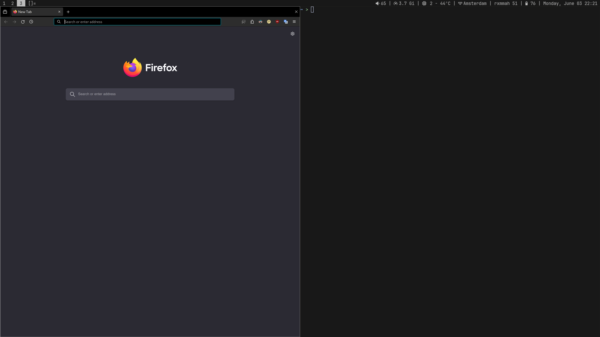
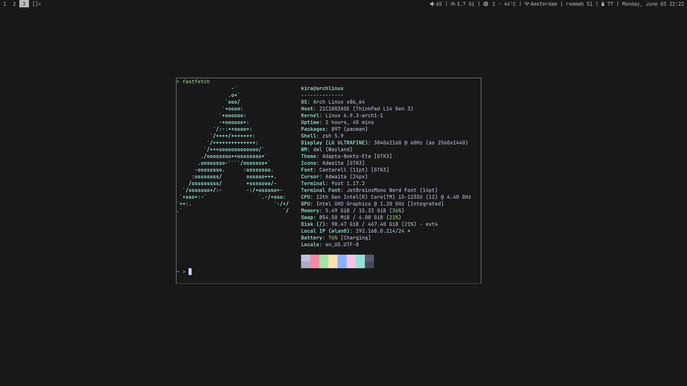

# dwl - dwm for Wayland
my personal patched build of [dwl](https://codeberg.org/dwl/dwl).

# preview

patch files used:
[alwayscenter.patch](https://codeberg.org/dwl/dwl-patches/src/branch/main/patches/alwayscenter)
[attachbottom.patch](https://codeberg.org/dwl/dwl-patches/src/branch/main/patches/attachbottom)
[autostart.patch](https://codeberg.org/dwl/dwl-patches/src/branch/main/patches/autostart)
[bar.patch](https://codeberg.org/dwl/dwl-patches/src/branch/main/patches/bar)
[hide_vacant_tags.patch](https://codeberg.org/dwl/dwl-patches/src/branch/main/patches/hide_vacant_tags)
[movestack.patch](https://codeberg.org/dwl/dwl-patches/src/branch/main/patches/movestack)
[simpleborders.patch](https://codeberg.org/dwl/dwl-patches/src/branch/main/patches/simpleborders)
[tablet-input.patch](https://codeberg.org/dwl/dwl-patches/src/branch/main/patches/tablet-input)
